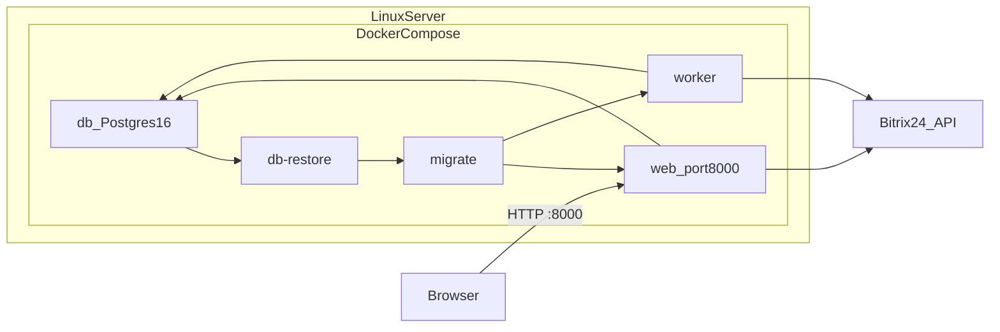

# Деплой на Linux-сервер

Пошаговая инструкция по развёртыванию `bitrix_export_web` на Linux-сервере через Docker Compose.

Приложение запускается **только через Docker Compose** — один стек: PostgreSQL + web (FastAPI) + worker (фоновый импорт Bitrix).



Быстрый старт (после установки Docker и клонирования репозитория):

```bash
cd bitrix_export_web
bash scripts/deploy_linux.sh
```

Если клонирован monorepo (корень `/opt/Anechka` или `simpleAnechka`):

```bash
bash deploy.sh
```

---

## 1. Требования к серверу

| Ресурс | Минимум |
|--------|---------|
| ОС | Linux (Ubuntu 22.04/24.04, Debian 12 и т.п.) |
| Docker | Engine 24+ и Compose v2 |
| RAM | 2 GB+ (рекомендуется 4 GB) |
| Диск | 5 GB+ свободно (seed-дамп ~1.3 GB + рост БД и exports) |
| Сеть | Исходящий доступ к Bitrix24 REST API; опционально OpenAI API |
| Порт | **8000** (HTTP) открыт в firewall, если доступ снаружи |

---

## 2. Установка Docker на сервер

```bash
# Ubuntu/Debian — официальный скрипт Docker
curl -fsSL https://get.docker.com | sh
sudo usermod -aG docker $USER
# Перелогиньтесь или:
newgrp docker

docker --version
docker compose version
```

Проверка: обе команды должны вывести версии без ошибок.

---

## 3. Клонирование репозитория

```bash
# Git LFS обязателен — database.sql (~1.3 GB) хранится в LFS
sudo apt install -y git git-lfs   # Debian/Ubuntu

git clone git@github.com:Parallel-Solutions/Anechka.git simpleAnechka
cd simpleAnechka/bitrix_export_web
git lfs pull
```

Без `git lfs pull` файл `database.sql` будет указателем LFS, а не реальным дампом — первый запуск restore не восстановит данные.

Проверка, что дамп скачан (файл должен быть ~1.3 GB, не ~130 байт):

```bash
ls -lh database.sql
head -1 database.sql   # не должно начинаться с "version https://git-lfs.github.com"
```

---

## 4. Настройка `.env`

```bash
cp .env.example .env
nano .env   # или vim
```

**Обязательно смените** (не оставляйте значения по умолчанию):

| Переменная | Назначение |
|------------|------------|
| `APP_SECRET_KEY` | Секрет приложения (случайная строка) |
| `POSTGRES_PASSWORD` | Пароль PostgreSQL |
| `BASIC_AUTH_PASSWORD` | Пароль HTTP Basic Auth для входа в UI |
| `BOOTSTRAP_ADMIN_PASSWORD` | Пароль bootstrap-админа |

**Рекомендуется задать сразу** (или позже через UI → Настройки):

- `BITRIX_WEBHOOK_URL` — входящий вебхук Bitrix24
- `OPENAI_API_KEY` — ключ OpenAI (AI-анализ, умные выгрузки, call results)
- `OPENAI_BASE_URL` — по умолчанию `https://api.openai.com/v1`
- `OPENAI_MODEL` — по умолчанию `gpt-4o`

`DATABASE_URL` в `.env` можно оставить как в примере — `docker-compose.yml` подставит пароль из `POSTGRES_PASSWORD` и хост `db` внутри docker-сети.

Генерация случайных секретов:

```bash
openssl rand -hex 32   # для APP_SECRET_KEY
openssl rand -hex 16   # для POSTGRES_PASSWORD и BASIC_AUTH_PASSWORD
```

---

## 5. Запуск production-стека (одна команда)

**Рекомендуемый способ** — обёртка с проверками restore/migrate/health:

```bash
cd /path/to/simpleAnechka/bitrix_export_web
bash scripts/deploy_linux.sh
```

Эквивалент (только Docker Compose):

```bash
docker compose up --build -d
```

Одна команда поднимает **весь стек**: PostgreSQL, seed-restore, миграции, web и worker. Отдельно restore или migrate запускать не нужно.

Порядок старта сервисов:

1. `db` — PostgreSQL 16, ждёт healthcheck
2. `db-restore` — восстанавливает `database.sql` **только если БД пустая** (см. ниже)
3. `migrate` — `alembic upgrade head`
4. `web` + `worker` — основное приложение

**Пропуск restore при существующей БД:** volume `pgdata` сохраняет данные между `docker compose down` / `up`. Если в `crm_entities` уже есть записи, `db-restore` пишет в лог `RESULT=skipped` и не перезаписывает базу. Обновлённый `database.sql` на сервере с данными **не накатится** без явного сброса: `docker compose down -v`.

Первый запуск может занять несколько минут из-за restore дампа (~1 GB).

---

## 6. Проверка

Скрипт `deploy_linux.sh` автоматически проверяет логи `db-restore` (`RESULT=restored` или `RESULT=skipped`), exit code `migrate` и `/health`.

Ручная проверка:

```bash
# Health (без авторизации)
curl http://localhost:8000/health
# Ожидается: {"status":"ok"}

# Результат seed-restore
docker compose logs db-restore | tail -5
# Первый деплой: RESULT=restored
# Повторный деплой (данные есть): RESULT=skipped

# Статус контейнеров
docker compose ps

# Логи (если что-то не поднялось)
docker compose logs -f web
docker compose logs db-restore migrate
```

**Проверка fresh deploy** (только на тестовом сервере — удалит все данные БД):

```bash
docker compose down -v
docker compose up --build -d
docker compose logs db-restore   # ожидается RESULT=restored
curl http://localhost:8000/health
```

В логах `web` при старте должна быть строка вида `Startup DB check: db=... crm_entities=N` — по ней видно, что БД подключена и есть данные.

Откройте в браузере: `http://<IP_сервера>:8000`  
Логин/пароль: `BASIC_AUTH_USERNAME` / `BASIC_AUTH_PASSWORD` из `.env`.

---

## 7. Первичная настройка после запуска

1. **Настройки** (`/settings`) — укажите вебхук Bitrix24, проверьте подключение.
2. **CRM Import** (`/bitrix-import`) — запустите импорт, если seed-данных недостаточно или нужны свежие данные.
3. **Call Results** (`/call-results`) — при необходимости; execute в Bitrix по умолчанию **выключен** (`CALL_RESULTS_BITRIX_EXECUTION_ENABLED=false`).

API-документация: `http://<IP>:8000/docs`

---

## 8. Firewall (если доступ из интернета)

```bash
# ufw (Ubuntu)
sudo ufw allow 8000/tcp
sudo ufw enable
```

> Для публичного доступа **рекомендуется** позже поставить reverse proxy (nginx/Caddy) с HTTPS и ограничить доступ. В репозитории готовых конфигов nginx нет — это настраивается на сервере отдельно. При HTTPS установите `COOKIE_SECURE=true` в `.env`.

---

## 9. Где хранятся данные

| Хранилище | Что |
|-----------|-----|
| Docker volume `pgdata` | База PostgreSQL |
| Docker volume `filestorage` | Импортированные файлы Bitrix |
| `./exports/` на хосте | Готовые XLSX |
| `./logs/` на хосте | Логи |

Остановка без потери данных: `docker compose down`  
Полный сброс (удалит БД): `docker compose down -v`

---

## 10. Обновление и обслуживание

| Задача | Команда |
|--------|---------|
| Prod-деплой (одна команда) | `bash scripts/deploy_linux.sh` |
| Обновить код и пересобрать | `git pull && git lfs pull && bash scripts/deploy_linux.sh` |
| Перезапуск только worker | `docker compose restart worker` |
| Бэкап / новый seed-дамп | `docker compose exec web python scripts/dump_db.py --output /app/database.sql` |
| Re-seed на сервере с данными | `docker compose down -v && bash scripts/deploy_linux.sh` (удалит БД!) |
| Тесты | `docker compose exec web pytest tests/test_restore_db.py` |
| Миграции вручную | `docker compose run --rm migrate` |

**Важно:** в prod-режиме исходники **не** монтируются в контейнер — любое изменение кода требует `docker compose up --build -d`. Не запускайте параллельно `uvicorn` на хосте на порту 8000.

**Seed-дамп и существующая БД:** при обычном `docker compose up` новый `database.sql` из git **не перезапишет** prod-базу — restore пропускается, если `crm_entities` не пуста. Для принудительного re-seed нужен `docker compose down -v`.

---

## 11. Типичные проблемы

| Симптом | Решение |
|---------|---------|
| `migrate` exit code **3** | Alembic `CommandError` — см. [§11.1](#111-migrate-exit-code-3) |
| `health` не отвечает | `docker compose logs web db migrate` — проверить, завершился ли restore/migrate |
| Пустая база / «База пуста» | Выполнить импорт на `/bitrix-import` или проверить, что `git lfs pull` скачал `database.sql` |
| «Кракозябры» в UI | `docker compose exec web python scripts/fix_mojibake.py` |
| Bitrix не подключается | Проверить `BITRIX_WEBHOOK_URL` в настройках |
| Порт 8000 занят | `ss -tlnp \| grep 8000` — освободить порт или изменить mapping в `docker-compose.yml` |

### 11.1 migrate exit code 3

Exit code **3** у сервиса `migrate` — это Alembic `CommandError`. Чаще всего БД после seed-restore содержит ревизию в `alembic_version`, которой нет в образе (устаревший код или деплой не из `bitrix_export_web/`).

**Диагностика** (выполнять из каталога с `docker-compose.yml`):

```bash
cd /path/to/Anechka/bitrix_export_web   # не из корня monorepo без -f

docker compose logs migrate
docker compose logs db-restore | tail -30
docker compose exec db psql -U bitrix -d bitrix_export -c "SELECT * FROM alembic_version;"
ls alembic/versions/ | wc -l   # ожидается 10 файлов
```

| Сообщение в логах migrate | Решение |
|---------------------------|---------|
| `Can't locate revision identified by '...'` | `git pull && git lfs pull`, затем `docker compose up --build -d` |
| `relation "..." already exists` | Схема уже есть: `docker compose run --rm migrate alembic stamp head`, затем `docker compose up -d` |
| `password authentication failed` | `POSTGRES_PASSWORD` в `.env` не совпадает с volume `pgdata` — вернуть старый пароль или `docker compose down -v` |
| `database.sql` — указатель LFS | `git lfs pull` (файл должен быть ~1.3 GB) |

**Первый деплой** (данные не нужны):

```bash
cd bitrix_export_web
git pull && git lfs pull
docker compose down -v
bash scripts/deploy_linux.sh
```

Если репозиторий клонирован как monorepo (корень `/opt/Anechka`), можно использовать обёртку из корня:

```bash
bash deploy.sh
```

---

## Связанные документы

- [README.md](README.md) — общая документация
- [BITRIX_IMPORT.md](BITRIX_IMPORT.md) — импорт CRM и бэкапы
- [.env.example](.env.example) — шаблон переменных окружения
