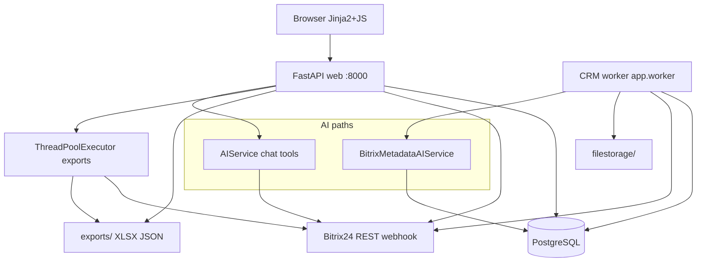
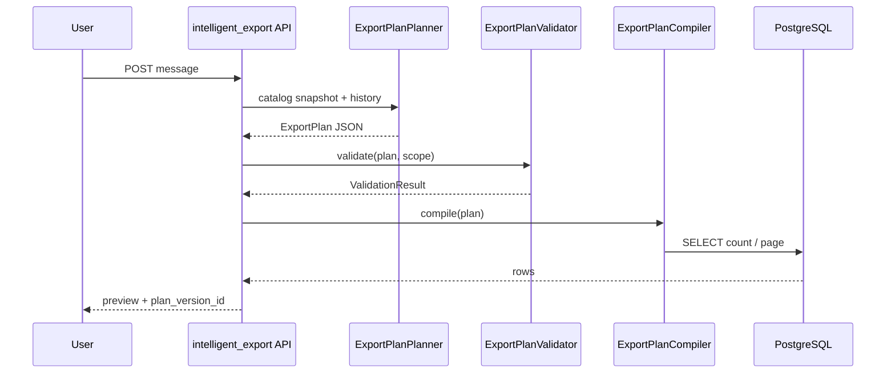
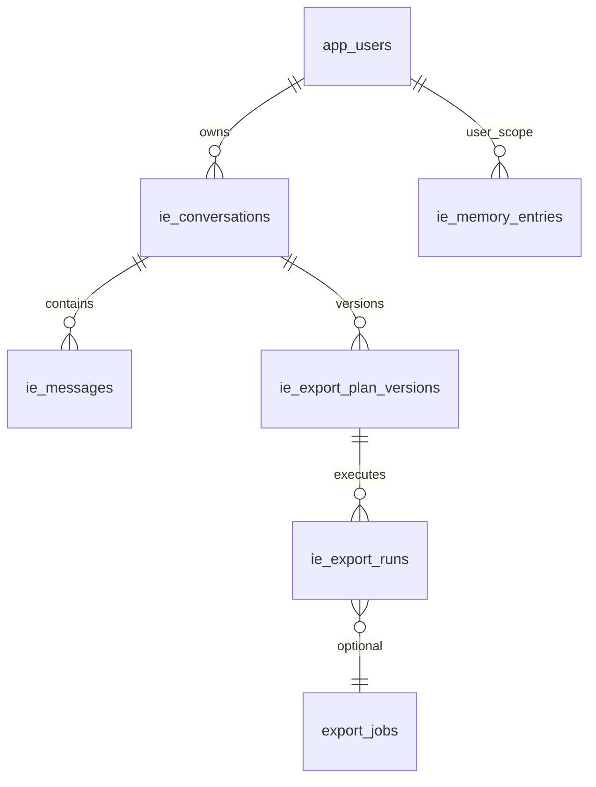
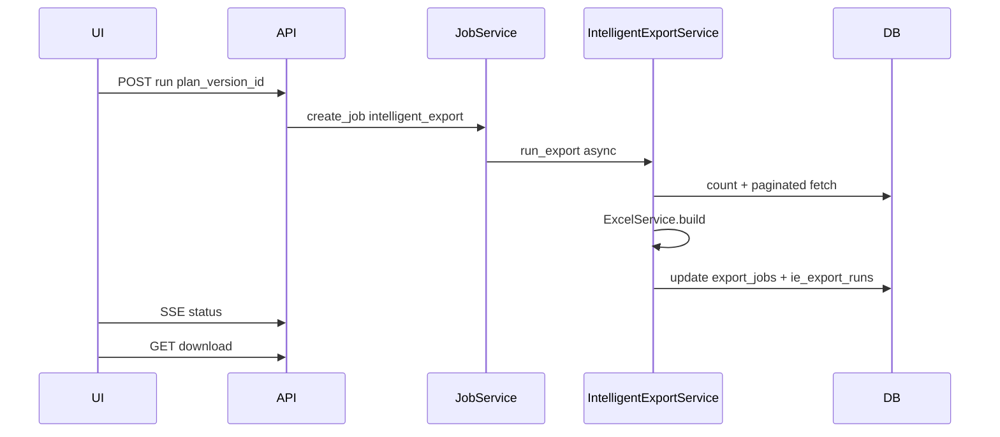

# Технический отчёт: подсистема интеллектуальных выгрузок

> Единый документ: анализ проекта + архитектурные решения + статус фазы 0.

> Дата сборки: 2026-06-25


## Содержание

1. [Часть I — Анализ существующего проекта](#часть-i--анализ-существующего-проекта)
2. [Часть II — Архитектурные решения (ADR)](#часть-ii--архитектурные-решения-adr)
3. [Часть III — Реализованные артефакты фазы 0](#часть-iii--реализованные-артефакты-фазы-0)
4. [Часть IV — Обновлённая оценка готовности](#часть-iv--обновлённая-оценка-готовности)

---

## Часть I — Анализ существующего проекта

# Технический анализ проекта перед подсистемой интеллектуальных выгрузок

---

## 1. Краткое резюме

1. **Проект** — монолитное веб-приложение [`bitrix_export_web`](.) для выгрузки Bitrix24 в Excel и импорта CRM в PostgreSQL.
2. **Стек**: Python 3.11+/FastAPI/Uvicorn, SQLAlchemy 2 + Alembic, PostgreSQL 16, Jinja2 + Bootstrap 5 + vanilla JS, openpyxl, OpenAI SDK.
3. **Архитектура**: один процесс web + отдельный worker для CRM-импорта; фоновые export-задачи — `ThreadPoolExecutor` в web-процессе ([`job_service.py`](app/services/job_service.py)).
4. **Готовность к новой подсистеме — частичная (~40/100)**: есть jobs, Excel, AI tools, каталог полей Bitrix; нет ExportPlan, auth, памяти, query compiler, CSV, server-side диалогов.
5. **Сильные стороны**: импорт leads/deals/contacts/companies; `crm_field_definitions` + AI semantics; multi-sheet Excel; structured JSON Schema для метаданных; SSE прогресс; path validation при скачивании.
6. **Критический риск**: **нет аутентификации и локальных прав Bitrix** ([`API.md`](API.md) L17); любой с доступом к порту видит все данные и диалоги.
7. **Критический риск**: текущий AI-чат работает с **live Bitrix REST**, не с локальной БД ([`ai_service.py`](app/services/ai_service.py) L29–32, L364–376) — модель может запрашивать произвольные фильтры через tools.
8. **Критический риск**: `crm_entity_field_values` и нормализованные связи **не заполняются** импортом — отчёты по локальной БД потребуют работы с `raw_payload` JSONB или доработки импорта.
9. **Leads**: импортируются ([`orchestrator.py`](app/services/bitrix_import/orchestrator.py) L23–24), но **не участвуют** в export/AI tools (только deal/contact/company).
10. **Память**: только `app_settings`, `ai_prompt_templates`, `crm_field_semantics`; нет project/user memory, aliases, mapping rules.
11. **История диалогов**: только client-side массив `history` в [`app.js`](app/static/js/app.js) L546–609; сервер не сохраняет.
12. **CSV**: отсутствует в application code.
13. **Мультипортал/tenant**: единственный `portal_id` из hostname вебхука ([`portal.py`](app/utils/portal.py)); сущности `project`/`workspace`/`organization` **отсутствуют**.
14. **CI/CD**: `.github/` **не найден**; тесты локальные pytest.
15. **Health check**: endpoint `/health` **отсутствует**.
16. **Объёмы таблиц**: **Не определено** без доступа к production БД.
17. **Главные неизвестные**: целевой deployment (публичный/внутренний), требования к multi-user, объёмы CRM, нужен ли CSV vs только Excel.
18. **Рекомендуемая безопасная цепочка** из ТЗ **не реализована**; есть отдельные кирпичики (AI tools, jobs, Excel, field catalog).

---

## 2. Технологический стек

| Технология | Версия (из deps/config) | Назначение | Конфигурация |
|---|---|---|---|
| Python | 3.11+ (README), 3.12-slim (Docker) | Runtime | [`Dockerfile`](Dockerfile) |
| FastAPI | >=0.110 | HTTP API + OpenAPI | [`app/main.py`](app/main.py) |
| Uvicorn | >=0.27 | ASGI server | [`Dockerfile`](Dockerfile) |
| Jinja2 | >=3.1 | Server HTML | [`app/templates/`](app/templates) |
| Bootstrap | 5.3.3 CDN | UI | [`base.html`](app/templates/base.html) L7 |
| SQLAlchemy | >=2.0 | ORM | [`app/database.py`](app/database.py) |
| Alembic | >=1.13 | Migrations | [`alembic/`](alembic) |
| PostgreSQL | 16-alpine | Primary DB | [`docker-compose.yml`](docker-compose.yml) |
| psycopg | >=3.1 | PG driver | `requirements.txt` |
| openpyxl | >=3.1 | Excel | [`excel_service.py`](app/services/excel_service.py) |
| OpenAI SDK | >=1.40 | AI | [`ai_service.py`](app/services/ai_service.py), [`metadata_ai_service.py`](app/services/bitrix_import/metadata_ai_service.py) |
| tiktoken | >=0.7 | Token counting | **В deps, но не используется в app/** |
| requests | >=2.31 | Bitrix HTTP | [`bitrix_client.py`](app/services/bitrix_client.py) |
| pydantic-settings | >=2.1 | Config | [`app/config.py`](app/config.py) |
| pytest + httpx | >=8 / >=0.27 | Tests | [`tests/`](tests) |
| Docker Compose | — | Deploy | 4 services: db, migrate, web, worker |

**Package manager**: pip + [`requirements.txt`](requirements.txt). **Нет** npm/webpack/pyproject.toml.

**Env vars** (имена): `APP_SECRET_KEY`, `DATABASE_URL`, `BITRIX_WEBHOOK_URL`, `OPENAI_API_KEY`, `OPENAI_MODEL`, `OPENAI_BITRIX_METADATA_MODEL`, `MAX_EXPORT_SIZE`, `MAX_WORKERS`, `EXPORT_DIR`, `FILE_STORAGE_DIR`, `WORKER_*`, `IMPORT_*`, `BITRIX_METADATA_PROMPT_VERSION`.

---

## 3. Карта архитектуры



**Потоки данных:**
- **Legacy export**: UI → `POST /exports/*` → `ExportJob` → `JobService` → `BitrixClient` (live) → `ExcelService` → `exports/`
- **AI chat**: UI → `POST /api/ai/chat` → `AIService.chat` → OpenAI + Bitrix tools → preview table + optional Excel token
- **CRM import**: Admin UI → `sync_runs` → worker → `ImportOrchestrator` → `crm_*` tables

---

## 4. Структура репозитория

```
simpleAnechka/
├── bitrix_export_web/          # Основное приложение
│   ├── app/
│   │   ├── main.py             # FastAPI entry, router mount
│   │   ├── worker.py           # CRM import worker loop
│   │   ├── config.py           # Settings merge db>env>defaults
│   │   ├── database.py         # SQLAlchemy engine/session
│   │   ├── schemas.py          # Export + AI DTOs
│   │   ├── schemas_bitrix.py   # Import admin DTOs
│   │   ├── models/legacy.py    # export_jobs, app_settings, ai_prompt_templates
│   │   ├── models/bitrix.py    # CRM import models (15 tables)
│   │   ├── routers/            # 6 routers (pages, exports, ai, bitrix, settings, admin_bitrix)
│   │   ├── services/           # Business logic (~20 modules)
│   │   ├── services/bitrix_import/  # Import orchestrator, discovery, metadata AI
│   │   ├── repositories/       # sync_repository, crm_repository
│   │   ├── templates/          # 13 Jinja2 pages
│   │   └── static/             # app.css, app.js
│   ├── alembic/versions/       # 1 migration: initial_schema
│   ├── tests/                  # 12 test modules
│   ├── scripts/clear_crm_import_data.py
│   ├── exports/, filestorage/, logs/
│   ├── Dockerfile, docker-compose.yml
│   └── README.md, API.md, BITRIX_IMPORT.md
├── tel_po_reg.py, tel_po_stadii.py  # Legacy standalone scripts (не в web app)
└── .cursor/rules/
```

**Точки входа:**
- Web: `docker compose up --build` → сервис `web` (uvicorn `app.main:app` :8000, hot-reload)
- Worker: сервис `worker` (`python -m app.worker`)
- Migrate: сервис `migrate` (`docker compose run --rm migrate`)
- Тесты и скрипты: `docker compose exec web pytest` / `docker compose exec web python scripts/...`

**Карта компонентов:**

| Компонент | Назначение | Расположение | Зависимости |
|---|---|---|---|
| FastAPI app | HTTP, lifespan, static | `app/main.py` | routers, JobService |
| Pages router | HTML UI | `app/routers/pages.py` | Jinja2, CrmRepository |
| Exports router | Export jobs API | `app/routers/exports.py` | JobService, BitrixClient |
| AI router | Chat + prompts | `app/routers/ai.py` | AIService, ExcelService |
| Admin Bitrix | CRM import admin | `app/routers/admin_bitrix.py` | SyncRepository, ImportOrchestrator |
| JobService | Export queue | `app/services/job_service.py` | ThreadPoolExecutor, export services |
| Import worker | CRM sync queue | `app/worker.py` | SyncRepository, ImportOrchestrator |
| BitrixClient | Live REST (exports/AI) | `app/services/bitrix_client.py` | requests |
| BitrixCrmClient | crm.item.* import | `app/services/bitrix_import/bitrix_crm_client.py` | requests |
| ExcelService | XLSX generation | `app/services/excel_service.py` | openpyxl |
| AIService | Chat + tools | `app/services/ai_service.py` | OpenAI, BitrixClient |
| BitrixMetadataAIService | Field semantics | `metadata_ai_service.py` | OpenAI structured output |
| CrmRepository | CRM persistence | `app/repositories/crm_repository.py` | SQLAlchemy models |

---

## 5. Модель данных

**СУБД**: PostgreSQL (prod), SQLite in-memory (tests). **ORM**: SQLAlchemy 2 Declarative. **Миграции**: Alembic, одна revision [`2b32241187b3_initial_schema.py`](alembic/versions/2b32241187b3_initial_schema.py).

**18 таблиц.** FK на уровне БД **отсутствуют** — связи через integer refs в application code.

### CRM-сущности (unified model)

| Таблица | PK | Назначение | Ключевые колонки |
|---|---|---|---|
| `crm_entities` | `id` | Leads/deals/contacts/companies | `portal_id`, `entity_type_id` (1–4), `entity_id`, `title`, `category_id`, `stage_id`, `assigned_by_id`, `raw_payload` JSONB, `is_deleted` |
| `crm_entity_versions` | `id` | Temporal audit payloads | `entity_type_id`, `entity_id`, `payload_hash`, `valid_from`/`valid_to`, `sync_run_id` |
| `crm_entity_field_values` | `id` | Normalized field values | typed columns, `field_definition_id`, `dictionary_entry_id`, `is_current` — **schema only, not populated** |

### Метаданные полей

| Таблица | PK | Назначение |
|---|---|---|
| `crm_field_definitions` | `id` | UF_* + system fields: `original_field_name`, `field_type`, `is_custom`, `settings`, `raw_definition` |
| `crm_field_definition_versions` | `id` | Schema change history |
| `crm_field_semantics` | `id` | AI display_name, data_category, confidence, `reviewed_by`, `is_manual` |

### Справочники

| Таблица | PK | Назначение |
|---|---|---|
| `crm_dictionaries` | `id` | enum/status/category/users/currencies |
| `crm_dictionary_entries` | `id` | `external_id`, `raw_value`, `normalized_value`, `raw_payload` |

### Пользователи Bitrix (не app users)

| Таблица | PK | Назначение |
|---|---|---|
| `crm_users` | `id` | Bitrix users mirror + dict `users` |

### Sync / jobs / app

| Таблица | PK | Назначение |
|---|---|---|
| `sync_runs` | `id` | Import jobs queue |
| `sync_checkpoints` | `id` | Incremental cursors |
| `export_jobs` | `id` | Excel export jobs |
| `app_settings` | `key` | KV settings (webhook, API keys, limits) |
| `ai_prompt_templates` | `id` | Reusable chat prompt shortcuts |

### Прочие (schema-ready, partially unused)

| Таблица | Статус |
|---|---|
| `crm_child_records` | Model + repo; orchestrator **не импортирует** |
| `crm_files` | Model + storage; orchestrator **не скачивает** |
| `crm_currencies` | Model; repo usage minimal |

**Soft delete**: `crm_entities.is_deleted`, `deleted_at`; dictionaries/fields — `is_active`.

**JSON**: `JSONType` → JSONB on PG ([`app/db/types.py`](app/db/types.py)).

**Vector/full-text search**: **отсутствует**.

**Объём данных**: **Не определено** (нет COUNT-запросов в репозитории для audit).

**Tenant isolation**: `portal_id` на всех CRM-таблицах; вычисляется из webhook host. Один активный webhook на инстанс (**Предположение**: single-tenant deployment).

---

## 6. Импорт Bitrix

### Механизм

- **Queue**: `sync_runs` + worker polling `FOR UPDATE SKIP LOCKED` ([`sync_repository.py`](app/repositories/sync_repository.py))
- **Orchestrator**: [`ImportOrchestrator`](app/services/bitrix_import/orchestrator.py)
- **Modes**: `full`, `incremental`, `reconciliation`, `schema_only`, `ai_reanalysis`

### Карта Bitrix → local

| Bitrix entity | entity_type_id | Local table | Key | Importer |
|---|---|---|---|---|
| Lead | 1 | `crm_entities` | `(portal_id, 1, entity_id)` | `orchestrator._import_entities_*` |
| Deal | 2 | `crm_entities` | `(portal_id, 2, entity_id)` | same |
| Contact | 3 | `crm_entities` | `(portal_id, 3, entity_id)` | `_import_related_entities` |
| Company | 4 | `crm_entities` | `(portal_id, 4, entity_id)` | same |
| Field metadata | per type | `crm_field_definitions` | `(portal_id, entity_type_id, original_field_name)` | `SchemaDiscoveryService.discover_fields` |
| Enumerations | per field | `crm_dictionaries` + entries | `dictionary_code=enum_*` | `_sync_enumeration` |
| Stages/status | per field | dictionaries `status_*` | `external_id` | `_sync_status_field` |
| Categories | deals | `category_{id}` | category id | `discover_dictionaries` (deals) |
| Users | global | `crm_users` + dict `users` | `external_id` | `sync_global_dictionaries` |
| Currencies | global | `crm_currencies` + dict | `currency_code` | same |

### API Bitrix (import)

`crm.item.fields`, `crm.item.list` (keyset), `crm.item.get`, `crm.status.list`, `crm.category.list`, `crm.currency.list`, `user.get` — [`bitrix_crm_client.py`](app/services/bitrix_import/bitrix_crm_client.py).

### Ключевые ответы на вопросы ТЗ

1. **Описания полей**: `crm_field_definitions.raw_definition` (JSON), labels: `title`, `listLabel`, `formLabel` в discovery ([`discovery_service.py`](app/services/bitrix_import/discovery_service.py) L38–54)
2. **Человекочитаемые названия**: также `crm_field_semantics.display_name` (AI) + PATCH semantics в admin API
3. **Справочники**: `crm_dictionaries` / `crm_dictionary_entries`
4. **UF_***: `is_custom=True`, `original_field_name` like `UF_CRM_*`
5. **Множественные значения**: в `raw_payload` как массивы; normalized table **не заполнена**
6. **Связи lead/deal/contact/company**: ID в `raw_payload` (`contactId`, `companyId`, …); denorm columns on entity; DealContacts только в live full export
7. **Автокаталог полей**: **да, частично** — join `crm_field_definitions` + `crm_field_semantics` + dictionaries по `entity_type_id`; потребуется API-слой и учёт `is_active`, `needs_review`

### Incremental / deleted / retry

- Incremental: checkpoint + overlap `IMPORT_OVERLAP_MINUTES` (default 10)
- Deleted: reconciliation soft-delete `is_deleted=true`
- Retries: HTTP retry in Bitrix clients (`MAX_RETRIES`, backoff)
- Permission skips logged in `BitrixCrmClient.diagnostics.permission_skips`

### Не реализовано в импорте

- `crm_entity_field_values` population
- Activities, timeline, stage history (`crm_child_records`)
- File download to `filestorage`
- Bitrix ACL / visibility rules

---

## 7. Интеграция с AI

### Два независимых контура

**A. AIService — интерактивный чат** ([`ai_service.py`](app/services/ai_service.py))

| Аспект | Реализация |
|---|---|
| SDK | `openai.OpenAI` |
| API | `chat.completions.create` |
| Model | `OPENAI_MODEL` (default `gpt-4o`) |
| Structured output | **Нет** (plain text + tools) |
| Tools | 9 functions: search_deals/contacts/companies, list_*, get_entity_fields, start_export, export_lpr_tomoru |
| History | Client sends full `messages[]`; server **не сохраняет** |
| Streaming | **Нет** |
| Token count | **Нет** (tiktoken unused) |
| Cost limits | `_clamp_limit` → `max_export_size` only |
| Data source | **Live Bitrix REST**, explicitly not local DB (system prompt L32) |
| Prompt injection | Minimal defense: fixed system prompt; user content passed through |
| Provider abstraction | **Нет** — direct OpenAI client |

**B. BitrixMetadataAIService — анализ полей** ([`metadata_ai_service.py`](app/services/bitrix_import/metadata_ai_service.py))

| Аспект | Реализация |
|---|---|
| Structured output | **Да** — `response_format` JSON Schema `FIELD_SCHEMA` strict |
| Input | Anonymized field metadata only ([`anonymize.py`](app/utils/anonymize.py)) |
| Cache | `source_hash` dedup; skip if unchanged |
| Persist | `crm_field_semantics` |
| RAG/embeddings | **Нет** |

### Оценка переиспользования для ExportPlan

| Задача | Пригодность |
|---|---|
| Многошаговый диалог | **Частично** — loop до 10 tool iterations; нет persistence |
| Structured ExportPlan | **Использовать паттерн metadata AI**, не chat path |
| Server tools | **Да** — `_execute_tool` pattern |
| Выбор полей из метаданных | **Да** — через admin fields API + semantics; chat uses live `get_entity_fields` |
| Память / RAG | **Нет** |
| Уточнение неоднозначностей | **Частично** — dialog in chat; no formal clarification state |
| Краткое описание результата | **Да** — assistant reply text |

**Вызов модели**: `AIService.chat` → `client.chat.completions.create`; `BitrixMetadataAIService._send_batch` → same API with schema.

---

## 8. Работа с файлами

**Библиотека**: openpyxl only. **CSV**: отсутствует.

| Capability | Support | Evidence |
|---|---|---|
| Multi-sheet | **Да** | `build_full_export`, `build_lpr_tomoru`, `build_normalized` (+ Info sheet) |
| Large datasets | **Ограничено** | All rows in memory; `MAX_EXPORT_SIZE=5000`; cell overflow → `.overflow.json` |
| Styles | **Minimal** | Bold headers, column width |
| Freeze panes | **Partial** | `_finalize_sheet` yes; `build_deals_contacts` explicitly **no** freeze (L294) |
| AutoFilter | **Partial** | `_finalize_sheet` yes; not on all builders |
| Date/number formats | **Partial** | Phone columns `@` format in some sheets |
| Formulas | N/A | Values only |
| Hyperlinks | **Нет** | — |
| Error sheet | **Нет** | — |
| Params sheet | **Да** | «Информация» info dict |
| Streaming generation | **Нет** | `wb.save(filepath)` after full build |
| Formula injection guard | **Да** | `sanitize_excel_value` prefixes `=+-@` ([`security_service.py`](app/services/security_service.py) L100–108) |
| CSV injection | N/A | No CSV |

**Хранение:**
- Exports: `EXPORT_DIR` (default `./exports`)
- AI cache: `{EXPORT_DIR}/ai/{token}.json`
- Bitrix files: `FILE_STORAGE_DIR` (schema ready)
- Download: `FileResponse` + `validate_download_path` ([`exports.py`](app/routers/exports.py))

**TTL / cleanup устаревших файлов**: **отсутствует**.

---

## 9. Аутентификация и права

| Механизм | Статус |
|---|---|
| User authentication | **Отсутствует** — documented in API.md L17 |
| Session / JWT | **Нет** |
| `APP_SECRET_KEY` | Defined in config, **unused in app code** |
| Authorization / RBAC | **Нет** |
| Row-level security | **Нет** |
| Bitrix webhook scope | Defines what Bitrix REST allows; stored in `app_settings` |
| Local CRM ACL after import | **Не импортируются и не применяются** — **критический риск** |
| Admin API protection | **Нет** — `/admin/bitrix/*` open |
| Download authorization | Job exists check only; no user binding |
| AI chat isolation | **Нет** — any client can POST any `messages` history |
| Multi-user `requested_by` | Column on `sync_runs` exists but not tied to auth |

**Вывод**: перед production multi-user export system **обязательны** auth + data scope + audit.

---

## 10. История и аудит

| Capability | Exists | Location |
|---|---|---|
| Export job history | **Да** | `export_jobs` + `event_log_json` (max 100 events) |
| Import run history | **Да** | `sync_runs.statistics_json` |
| Entity payload versions | **Да** | `crm_entity_versions` |
| Field schema versions | **Да** | `crm_field_definition_versions` |
| AI chat messages | **Нет** (client-only) | `app.js` history array |
| ExportPlan versions | **Нет** | — |
| File history | **Partial** | `export_jobs.result_file` path only |
| Admin audit trail | **Partial** | `crm_field_semantics.reviewed_at/by`; no global audit log |

**Можно ли на текущей структуре:**
- Список диалогов / restore — **нет**, нужны новые таблицы
- ExportPlan versioning / rollback — **нет**
- Re-run past export — **частично** via `retry_job` (same params, new job)
- Validation result storage — **нет**
- Row/error counts — **частично** in `export_jobs.statistics_json`

---

## 11. Память проекта

### Существующие механизмы

| Layer | Mechanism | Scope |
|---|---|---|
| System metadata | `crm_field_definitions`, dictionaries, semantics | portal |
| Config | `app_settings` KV | global instance |
| Prompt shortcuts | `ai_prompt_templates` | global, no user_id |
| LPR heuristics | `app_settings` keys via `lpr_service.py` | global |
| AI field semantics | `crm_field_semantics` | portal + manual review |

### Четыре уровня памяти (оценка)

| Level | Reuse | Gap |
|---|---|---|
| 1. System metadata | **High** — field/dictionary catalog | Needs ExportPlan field registry API |
| 2. Project memory | **Low** — only global settings | No business rules, aliases, templates, mappings |
| 3. User memory | **None** | No user entity |
| 4. Dialog context | **Client-only** | No server persistence |

**Project/workspace entity**: **отсутствует**. Ближайший аналог — `portal_id` (single Bitrix portal per instance).

**Конфликты**: global `ai_prompt_templates` + global LPR config — все пользователи делят одно (**критично при multi-user**).

---

## 12. Производительность

| Factor | Assessment |
|---|---|
| Table volume | **Не определено** |
| Query pattern today | Live Bitrix pagination; local admin lists use offset/limit |
| JOIN complexity | Normalized export would need JSONB queries or populate `crm_entity_field_values` |
| Indexes | On `portal_id`, `entity_type_id`, `is_deleted`, composites — migration L indexes |
| Pagination | Admin API `page`/`page_size` ≤200; export list **unbounded** |
| Streaming | **Нет** for Excel or DB reads |
| Memory | Full datasets in Python lists before Excel save |
| Web process limits | Export jobs share ThreadPoolExecutor with HTTP (default 2 workers) |
| Queue | DB queue for import; in-memory executor for export — **no Redis** |
| Cancel | `cancel_requested` flag polled |
| Progress | DB fields + SSE (`text/event-stream`) |
| Concurrent exports | Limited by `MAX_WORKERS` (default 2) |
| Row limit | `MAX_EXPORT_SIZE` default 5000 |
| Timeouts | Bitrix read 60s; **нет** global export timeout |
| COUNT preview | **Нет** dedicated endpoint |
| Metadata cache | BitrixClient in-memory user/contact caches; settings `@lru_cache` |

**Тяжёлые участки**: `FullCategoryExportService` (many REST calls); full import keyset pagination; AI metadata batch up to 24 fields × OpenAI calls.

---

## 13. Безопасность (риски по критичности)

### Блокирует реализацию (production multi-user)

- **Нет authentication** — любой доступ = полный доступ
- **Bitrix ACL не применяется локально** — импортированные PII доступны через admin API и будущие отчёты без фильтрации
- **AI tools принимают произвольные Bitrix filters** от модели — обход intent через prompt injection

### Высокий риск

- **Нет лимита на размер AI chat history** — DoS via large POST body
- **Нет TTL файлов exports/** — disk exhaustion
- **Нет rate limiting** on OpenAI/Bitrix calls
- **Секреты в `app_settings` plaintext** in DB
- **AI cache tokens** (`uuid.hex`) — guessable space 128-bit OK, but **no auth on download**
- **DoS тяжёлыми отчётами** — only row count limit, no CPU/time budget
- **Логирование** — may include errors with data; no explicit PII redaction policy in code

### Средний риск

- **Formula injection** — mitigated by `sanitize_excel_value`
- **Path traversal downloads** — mitigated by `validate_download_path`
- **CSV injection** — N/A until CSV exists
- **JSON deserialization** — standard `json.loads` on trusted/internal sources; AI tool args parsed without schema validation beyond OpenAI
- **No prompt injection hardening** beyond static system prompt
- **APP_SECRET_KEY unused** — missed opportunity for signed download tokens

### Некритичное

- No CORS middleware (local app assumption)
- No health/metrics endpoints
- tiktoken listed but unused for cost control

---

## 14. Что можно переиспользовать

| Компонент | Где | Сейчас | Переиспользование | Ограничения |
|---|---|---|---|---|
| AIService tool loop | `ai_service.py` | Chat + Bitrix tools | Dialog orchestration pattern | Live Bitrix only; no ExportPlan schema |
| Metadata AI + JSON Schema | `metadata_ai_service.py` | Field semantics | **ExportPlan generation pattern** | Different schema needed |
| Bitrix field catalog | `crm_field_definitions`, semantics, dictionaries | Import admin UI | Metadata Catalog source | Normalized values missing; leads not in exports |
| CrmRepository | `crm_repository.py` | Upsert/list entities | Data access layer base | No query compiler; no field_values |
| JobService | `job_service.py` | Export jobs | Export Job Service pattern | In-process threads; no user scope |
| SyncRepository + worker | `sync_repository.py`, `worker.py` | Import queue | Long-running job pattern | Separate domain |
| ExcelService | `excel_service.py` | Multi-sheet XLSX | Excel Output Engine base | In-memory; no CSV; limited styling |
| Security helpers | `security_service.py` | Filename, path, excel sanitize | File delivery safety | No auth |
| SSE status | `exports.py`, `admin_bitrix.py` | Progress UI | Export/import progress | Not for LLM stream |
| AI prompts CRUD | `ai_prompt_service.py` | Shortcut templates | Partial template memory | Global, not scoped |
| Admin fields API | `admin_bitrix.py` | Browse/patch semantics | Field picker backend | No auth |
| Pagination pattern | `crm_repository.list_entities_paginated` | Entity browser | Preview pagination | Filters limited |
| Anonymization | `anonymize.py` | Metadata AI input | Safe AI context building | Not used in chat path |
| Export JSON sidecar | `json_export_service.py` | Parallel JSON file | Preview/interchange | Not generic plan format |
| Frontend chat UI | `ai.html`, `app.js` | AI page | Chat UX baseline | No persistence, no streaming |
| Frontend tables/forms | `index.html`, bitrix-import pages | Export forms, admin | Preview/history layouts | No plan editor |

---

## 15. Чего не хватает (gap analysis)

| Компонент | Полностью | Частично | Отсутствует | Комментарий |
|---|:---:|:---:|:---:|---|
| Conversation Service | | | ✓ | Client history only |
| Хранение сообщений | | | ✓ | — |
| Версионирование ExportPlan | | | ✓ | — |
| Metadata Catalog | | ✓ | | DB tables exist; no export-oriented API |
| AI Planner | | ✓ | | Chat + metadata AI separately |
| JSON Schema ExportPlan | | ✓ | | FIELD_SCHEMA exists for fields only |
| ExportPlan Validator | | | ✓ | — |
| Query Compiler | | | ✓ | AI uses raw Bitrix filters |
| Transformation Engine | | ✓ | | phone_service, lpr heuristics, excel serialize |
| Validation Engine | | | ✓ | — |
| Excel Output Engine | ✓ | | | openpyxl multi-sheet |
| Preview Service | | ✓ | | AI table preview in chat |
| Export Job Service | ✓ | | | export_jobs + JobService |
| File storage | ✓ | | | exports/ + filestorage schema |
| История запусков | ✓ | | | export_jobs, sync_runs |
| Project memory | | ✓ | | app_settings, semantics only |
| User memory | | | ✓ | No app users |
| Memory search | | | ✓ | No vector/FTS |
| Template versioning | | | ✓ | ai_prompt_templates no versions |
| Memory ACL | | | ✓ | — |
| Audit | | ✓ | | entity/field versions only |
| Frontend chat | | ✓ | | Exists, no persistence |
| Frontend constructor | | | ✓ | — |
| Frontend preview | | ✓ | | Chat table + export detail |
| Frontend history | | ✓ | | /exports list only |
| Frontend memory mgmt | | | ✓ | — |
| CSV export | | | ✓ | — |
| Auth / RBAC | | | ✓ | — |
| Local data ACL | | | ✓ | — |

---

## 16. Рекомендуемые точки интеграции

### 1. API диалогов и ExportPlan
- **Модуль**: новый router рядом с [`app/routers/ai.py`](app/routers/ai.py) или расширение `ai.router`
- **Почему**: уже есть `POST /api/ai/chat`, prompts, Excel download by token
- **Риски**: смешение live-Bitrix chat с local-DB export; нужна чёткая separation
- **Зависимости**: `AIService`, `schemas.py`, новые models

### 2. Metadata Catalog API
- **Модуль**: расширить [`admin_bitrix.py`](app/routers/admin_bitrix.py) или публичный `/api/catalog/*`
- **Почему**: `GET /admin/bitrix/fields`, dictionaries, semantics patch уже реализованы
- **Риски**: admin routes без auth; нужен read-only scoped API
- **Зависимости**: `CrmRepository`, `crm_field_definitions`, `crm_field_semantics`

### 3. ExportPlan Validator + Query Compiler
- **Модуль**: новый `app/services/export_plan/` (рядом с export services)
- **Почему**: изолировать от `AIService._execute_tool` и Bitrix raw filters
- **Риски**: без populated `crm_entity_field_values` compiler сложнее (JSONB paths)
- **Зависимости**: SQLAlchemy models, `CrmRepository`, field catalog

### 4. Preview Service
- **Модуль**: рядом с [`export_service.py`](app/services/export_service.py) pattern
- **Почему**: существующий AI table preview + paginated entity list
- **Риски**: performance on large previews
- **Зависимости**: Query compiler, pagination from `crm_repository`

### 5. Export execution
- **Модуль**: расширить [`JobService`](app/services/job_service.py) новым `mode=intelligent_export`
- **Почему**: queue, cancel, retry, SSE, download уже работают
- **Риски**: long jobs block thread pool shared with HTTP
- **Зависимости**: `ExcelService`, `export_jobs` table extension

### 6. Structured AI Planner
- **Модуль**: паттерн [`BitrixMetadataAIService`](app/services/bitrix_import/metadata_ai_service.py) — **не** chat AIService
- **Почему**: strict JSON Schema уже proven for field analysis
- **Риски**: schema evolution needs versioning
- **Зависимости**: OpenAI, catalog snapshot in prompt (not raw DB)

### 7. Persistence (conversations, plans, memory)
- **Модуль**: новые models + Alembic migrations in [`app/models/`](app/models)
- **Почему**: no existing tables fit dialog/plan/memory
- **Риски**: migration coordination with single initial migration in prod
- **Зависимости**: PostgreSQL JSONB patterns from existing models

### 8. Frontend
- **Модуль**: extend [`ai.html`](app/templates/ai.html) + [`app.js`](app/static/js/app.js)
- **Почему**: chat UI, table preview, download buttons exist
- **Риски**: vanilla JS scalability for plan editor
- **Зависимости**: Bootstrap patterns from bitrix-import pages

---

## 17. Вопросы, невозможные разрешить по коду

1. **Deployment context**: приложение публичное или только корпоративная сеть/VPN? (**Не определено**)
2. **Multi-user requirements**: нужны ли отдельные пользователи, роли, personal memory? (**Не определено**)
3. **Data volumes**: сколько записей в `crm_entities` в production? (**Не определено**)
4. **Source of truth для выгрузок**: локальная БД или live Bitrix? Текущий AI явно live; импорт заполняет local. (**Требует продуктового решения**)
5. **Bitrix permission model**: какие права у webhook-пользователя; можно ли их мапить на app users? (**Не определено** без runtime Bitrix profile)
6. **Retention policy**: сколько хранить exports, AI cache, dialog history? (**Не определено**)
7. **CSV mandatory?** В коде CSV нет; только Excel. (**Требует подтверждения**)
8. **Leads in export scope**: импортированы, но не в export/AI tools — включать ли? (**Требует подтверждения**)

---

## 18. Приложение: подтверждающие ссылки

| Вывод | Путь | Класс/функция/таблица | Строки |
|---|---|---|---|
| FastAPI monolith entry | `app/main.py` | `app`, `lifespan` | 19–53 |
| No authentication | `API.md` | doc section 1 | 17 |
| APP_SECRET_KEY unused | `app/config.py` | `Settings.app_secret_key` | 36; grep shows no other usage |
| PostgreSQL default | `app/config.py` | `database_url` | 37–39 |
| 18 DB tables | `alembic/versions/2b32241187b3_initial_schema.py` | `upgrade()` | 22+ |
| Unified CRM entities | `app/models/bitrix.py` | `CrmEntity`, `ENTITY_*` | 25–29, 81+ |
| No FK/relationship ORM | `app/models/` | — | no ForeignKey in models |
| Export thread pool | `app/services/job_service.py` | `JobService.get_executor` | 31–36 |
| MAX_EXPORT_SIZE 5000 | `app/config.py` | `max_export_size` | 49 |
| CRM import worker | `app/worker.py` | `run_worker` | file |
| Import modes | `app/models/bitrix.py` | `SYNC_MODES` | 31 |
| Leads imported | `orchestrator.py` | `PRIMARY_ENTITY_TYPES` | 23–24 |
| Field values not imported | `orchestrator.py` | no calls to upsert field values | verified by grep |
| portal_id tenant | `app/utils/portal.py` | `portal_id_from_webhook` | 8–13 |
| AI live Bitrix not local DB | `ai_service.py` | `SYSTEM_PROMPT` | 29–32 |
| OpenAI tools chat | `ai_service.py` | `AIService.chat`, `TOOLS` | 179+, 364–376 |
| Structured metadata AI | `metadata_ai_service.py` | `FIELD_SCHEMA`, `analyze_fields` | 29–74, 90+ |
| Client-only chat history | `app/static/js/app.js` | `initAIPage`, `history` | 546–609 |
| Excel multi-sheet | `excel_service.py` | `build_full_export` | 329–384 |
| Formula injection guard | `security_service.py` | `sanitize_excel_value` | 100–108 |
| Download path validation | `security_service.py` | `validate_download_path` | 76–89 |
| SSE job status | `app/routers/exports.py` | `export_status` | ~121–126 |
| Field discovery UF | `discovery_service.py` | `discover_fields` | 38–54 |
| No CSV | `app/` grep | — | no csv writer |
| No health endpoint | `app/` grep | — | no matches |
| No CI | `.github/` | — | not found |
| Tests SQLite memory | `tests/conftest.py` | fixtures | 19–41 |
| Docker 4 services | `docker-compose.yml` | services | 1–69 |
| tiktoken unused | `requirements.txt` vs `app/` | — | dep only |

---

## Оценка готовности: **38/100**

**Пояснение:**
- **+15** — зрелый каркас приложения (FastAPI, jobs, Docker, migrations, tests)
- **+15** — импорт Bitrix + богатые метаданные полей/справочников + AI semantics
- **+8** — Excel engine с multi-sheet и базовой security sanitization
- **+5** — AI infrastructure (tools loop + strict JSON Schema precedent)

**−20** — отсутствие auth/RBAC и локальных прав (блокер для безопасной системы из ТЗ)
**−10** — нет ExportPlan pipeline, validator, query compiler, conversation persistence
**−10** — normalized field values / child records не заполнены — gap для отчётов по local DB
**−5** — нет CSV, streaming, TTL, cost/token controls, CI

Проект — **хорошая платформа для эволюции**, но **не готов** к безопасному внедрению описанной подсистемы без архитектурных решений по auth, источнику данных (local vs live), и нового домена ExportPlan.


---

## Часть II — Архитектурные решения (ADR)

# ADR-001: Аутентификация, RBAC и права на данные

**Статус:** Принято  
**Дата:** 2026-06-25  
**Контекст:** [`API.md`](API.md) L17 — «Аутентификация: Нет». `APP_SECRET_KEY` в [`config.py`](app/config.py) не используется. Bitrix ACL после импорта не применяется.

---

## Решение

### 1. Модель пользователей приложения

Вводится таблица `app_users` (см. ADR-005), **отдельная** от `crm_users` (зеркало Bitrix).

| Поле | Назначение |
|------|------------|
| `id` | PK |
| `email` / `login` | Уникальный идентификатор |
| `password_hash` | bcrypt (или argon2) |
| `display_name` | UI |
| `role` | `admin` \| `analyst` \| `viewer` |
| `crm_user_external_id` | Опциональная связь с `crm_users.external_id` для scope |
| `is_active` | Блокировка |
| `portal_id` | Изоляция портала (как у CRM-таблиц) |

**Фаза 1 (MVP):** cookie-сессия на `APP_SECRET_KEY` + signed session token (itsdangerous / starlette SessionMiddleware).  
**Фаза 2 (опционально):** Bitrix OAuth для SSO — не блокирует MVP.

### 2. RBAC — три роли

| Роль | Intelligent export | Admin CRM import | Settings | Memory (project) |
|------|-------------------|------------------|----------|------------------|
| `admin` | full | full | full | read/write |
| `analyst` | create/run/preview | read | read | read |
| `viewer` | preview only (scoped) | read (scoped) | — | read |

Проверка роли — FastAPI dependency `require_role("analyst")` в новом router `app/routers/intelligent_export.py`.

### 3. Bitrix ACL → локальные права

**Факт:** права Bitrix (видимость сделок по отделам, «мои» vs «все») **не импортируются** в PostgreSQL ([`orchestrator.py`](app/services/bitrix_import/orchestrator.py) не сохраняет ACL).

**Решение — app-level data scope (не реплика Bitrix ACL):**

| Scope | Правило для `viewer` | Правило для `analyst`/`admin` |
|-------|---------------------|-------------------------------|
| `assigned_only` | `crm_entities.assigned_by_id = app_users.crm_user_external_id` | без ограничения по ответственному |
| `entity_types` | whitelist типов (default: deal, contact) | все импортированные типы |
| `denied_fields` | список field_code из project memory | admin может override |
| `max_rows` | `min(plan.limit, role_limit)` | `min(plan.limit, max_export_size)` |

**Критический риск (явно принят):** локальная выгрузка **не эквивалентна** Bitrix ACL. В UI и audit логируется предупреждение: «Доступ определяется ролью приложения, не правами Bitrix24».

**Mitigation:**
- Привязка `app_users.crm_user_external_id` к Bitrix user ID вебхука/сотрудника.
- Опциональный режим `strict_bitrix_scope`: для preview дополнительно вызывать `crm.item.list` с тем же filter (только COUNT/IDs) — **фаза 2**, не MVP.

### 4. Изоляция ресурсов

| Ресурс | Правило |
|--------|---------|
| Диалоги (`ie_conversations`) | `user_id = current_user.id` |
| ExportPlan versions | через conversation ownership |
| Файлы выгрузки | `export_jobs` + проверка `created_by_user_id` (новая колонка) |
| Download URL | signed token или session + job ownership |
| Project memory | `portal_id` + role `admin` для write |

### 5. Middleware

```
Request → SessionAuthMiddleware → get_current_user (optional on public pages)
       → RoleChecker (on /api/intelligent-export/*)
       → ExportScopeEnforcer (in Validator/Compiler)
```

Публичные без auth (до миграции): `/`, `/settings` — **временно**; все `/api/intelligent-export/*` — **только authenticated**.

### 6. Миграция с текущего состояния

1. Добавить `app_users` + seed admin из env `BOOTSTRAP_ADMIN_EMAIL` / `BOOTSTRAP_ADMIN_PASSWORD`.
2. Обернуть `/admin/bitrix/*` в `require_role("admin")`.
3. Legacy AI chat (`/api/ai/chat`) — `require_role("analyst")` или read-only mode.
4. Обновить [`API.md`](API.md) — убрать «Аутентификация: Нет».

---

## Последствия

- **(+)** Блокер безопасности снят для production multi-user.
- **(-)** Bitrix ACL не воспроизводится полностью — документировать для пользователей.
- **(-)** Требуется bootstrap admin и миграция UX (login page).

## Альтернативы (отклонены)

| Альтернатива | Причина отклонения |
|--------------|-------------------|
| Оставить без auth (VPN only) | Не масштабируется; не защищает диалоги/файлы |
| Полная реплика Bitrix ACL | Нет данных в импорте; высокая сложность |
| API key per user | Нет UX для memory/dialog ownership |


# ADR-002: Источник данных для intelligent export

**Статус:** Принято  
**Дата:** 2026-06-25  
**Контекст:** [`AIService`](app/services/ai_service.py) использует **live Bitrix REST**. [`ImportOrchestrator`](app/services/bitrix_import/orchestrator.py) наполняет **локальную PostgreSQL**.

---

## Решение

### Primary source: локальная PostgreSQL

Intelligent export **читает данные только из локальной БД** через `QueryCompiler` → `CrmEntity` (+ joins по plan).

**Обоснование:**
- Предсказуемая производительность и `COUNT` для preview.
- Единый audit trail (какой snapshot импорта использован).
- AI не получает произвольный доступ к Bitrix filters (см. ADR-004).
- Согласованность с каталогом полей (`crm_field_definitions`, semantics, dictionaries).

**Обязательное условие:** актуальный CRM import (`sync_runs` completed, checkpoint fresh). UI показывает `last_successful_sync_at` из `sync_checkpoints`.

### Secondary source: live Bitrix — только служебно

| Сценарий | Live Bitrix | Local DB |
|----------|-------------|----------|
| Intelligent export (preview/run) | **Нет** | **Да** |
| Legacy AI chat ([`ai.py`](app/routers/ai.py)) | Да (сохранить) | Нет |
| Legacy exports (region/stage) | Да | Нет |
| Staleness warning | `profile` / dashboard timestamp | checkpoint age |
| Strict scope verify (фаза 2) | COUNT only | primary |

### Entity coverage

| entity_type_id | Импорт | Intelligent export MVP |
|----------------|--------|------------------------|
| 1 Lead | Да | **Да** (включить в catalog) |
| 2 Deal | Да | Да |
| 3 Contact | Да | Да |
| 4 Company | Да | Да |

Leads ранее отсутствовали в AI tools — в intelligent export **включаются** через единый `CrmEntity` model.

### Связи между сущностями

**MVP:** join по ID из `raw_payload` (`contactId`, `companyId`, `contactIds`) + denorm columns (`category_id`, `stage_id`).

**Фаза 2:** normalized `crm_entity_field_values` (ADR-003) для фильтров по UF без JSONB path.

### Freshness policy

| Checkpoint age | Поведение |
|----------------|-----------|
| < 1 час | normal |
| 1–24 часа | warning banner |
| > 24 часа | block run (allow preview with warning); suggest incremental import |

Константы — `app_settings` keys: `ie_max_staleness_hours`.

---

## Последствия

- Query compiler **не зависит** от `BitrixClient`.
- Пользователь должен понимать lag импорта.
- Import worker становится **критической** зависимостью intelligent export.

## Альтернативы (отклонены)

| Альтернатива | Причина |
|--------------|---------|
| Live Bitrix primary | AI/tools риск; rate limits; нет единого plan validation |
| Hybrid per-request live fetch | Непредсказуемое время; сложный audit |
| Dual-write on export | Дублирование логики legacy + intelligent |


# ADR-003: Нормализация импорта (`crm_entity_field_values`, child records)

**Статус:** Принято  
**Дата:** 2026-06-25  
**Контекст:** Таблица [`crm_entity_field_values`](app/models/bitrix.py) и метод [`CrmRepository.replace_field_values`](app/repositories/crm_repository.py) существуют, но [`ImportOrchestrator`](app/services/bitrix_import/orchestrator.py) **не вызывает** их. [`crm_child_records`](app/models/bitrix.py) — schema-only.

---

## Решение

### Фазирование

| Фаза | Query compiler | Import |
|------|----------------|--------|
| **MVP (intelligent export v1)** | `CrmEntity` denorm columns + `raw_payload` JSONB paths | без изменений |
| **v1.1** | + фильтры/sort по `crm_entity_field_values` | populate on upsert |
| **v2** | joins через child records | import activities, stage history |

### MVP: достаточно `raw_payload` + denorm

**Denormalized columns** (уже в `crm_entities`):
`title`, `category_id`, `stage_id`, `assigned_by_id`, `amount`, `source_id`, `currency_id`, `created_time`, `updated_time`, `closed_at`.

**JSONB access** (PostgreSQL):
```sql
raw_payload->>'STAGE_ID'
raw_payload @> '{"UF_CRM_...": "value"}'
```

Compiler whitelist maps catalog field → `{source: "column"|"jsonb", path: "..."}`.

**Ограничения MVP:**
- Фильтры по multifield (PHONE arrays) — через transform post-fetch или simplified text cast.
- Сложные relation joins — только explicit plan joins по известным ID-полям.

### v1.1: populate `crm_entity_field_values` (рекомендовано до сложных отчётов)

Добавить в `ImportOrchestrator._persist_entity` после `upsert_entity`:

1. Load active `CrmFieldDefinition` for entity_type_id.
2. Extract values from payload per field_type (enumeration → dictionary_entry_id, user → related_entity, etc.).
3. Call `replace_field_values`.

**Приоритет полей:** все `is_active` definitions; skip file/address on v1.1.

**Оценка трудозатрат:** средняя (1–2 недели) — отдельная задача импорта, **не блокер MVP**.

### `crm_child_records` — отложить

Импорт `crm.activity.list`, `crm.stagehistory.list` — **не нужен** для MVP (deals/leads/contacts/companies sheets).

Включить когда потребуются листы «История стадий» / «Активности».

---

## Матрица: нужно ли нормализовать до query compiler?

| Возможность | MVP без field_values | С field_values |
|-------------|---------------------|----------------|
| Filter STAGE_ID, CATEGORY_ID | denorm columns | either |
| Filter UF_CRM_* | JSONB path | indexed column |
| Sort by custom UF | JSONB (slow) | numeric_value/date_value |
| Group by dictionary label | join dictionaries via external_id in JSONB | dictionary_entry_id FK |
| Phone normalization export | transform engine | text_value |

**Вывод:** MVP **можно** запускать без доработки импорта; **v1.1 field_values обязательна** при >10k entities и частых UF-фильтрах.

---

## Последствия

- Compiler в MVP содержит `JsonbFieldResolver` — явный mapping, не generic JSONPath от AI.
- Performance risk на больших JSONB фильтрах — мониторинг + индекс GIN на `raw_payload` (optional migration).

## Action items (import team)

1. `orchestrator.py` — hook `FieldValueExtractor.extract(entity, definitions)` → `replace_field_values`.
2. Unit tests with fixtures from [`tests/fixtures/bitrix_import_fixtures.py`](tests/fixtures/bitrix_import_fixtures.py).
3. Backfill job: `mode=field_values_backfill` one-time sync run.


# ADR-004: ExportPlan — JSON Schema, Validator, Query Compiler

**Статус:** Принято  
**Дата:** 2026-06-25  

---

## Решение

### 1. Контракт ExportPlan v1.0

Файл: [`export_plan.schema.json`](export_plan.schema.json)  
Pydantic: [`app/services/export_plan/models.py`](app/services/export_plan/models.py)

AI (ExportPlanPlanner) **только** возвращает JSON, соответствующий schema. Парсинг через Pydantic → `ExportPlan`.

### 2. Metadata Catalog

[`FieldCatalog.load()`](app/services/export_plan/catalog.py) строит whitelist из:
- `DENORM_FIELD_MAP` — системные колонки `crm_entities`
- `crm_field_definitions` + `crm_field_semantics` — UF и прочие поля (`storage=jsonb`)

Validator отклоняет любой `field_code` вне catalog.

### 3. ExportPlanValidator

[`ExportPlanValidator`](app/services/export_plan/validator.py):
- Проверка catalog, filter ops, transform ops, join aliases
- `ExportScope` — role-based limits (ADR-001)
- Viewer: обязательный filter `ASSIGNED_BY_ID eq crm_user_external_id`
- `max_rows` cap vs `max_export_size`

**Не доверяет AI** — даже valid JSON может быть отклонён.

### 4. ExportPlanCompiler

[`ExportPlanCompiler`](app/services/export_plan/compiler.py):
- Input: validated `ExportPlan`
- Output: `CompiledQuery` with SQLAlchemy `Select` objects
- **Запрещено:** `text()`, raw SQL strings, `eval`, dynamic JSONPath from user/AI
- Filters только из whitelist ops → SQLAlchemy expressions
- Fields: column map или `raw_payload` JSON subscript (PG JSONB / SQLite JSON for tests)

### 5. ExportPlanPlanner (AI) — отдельный сервис (следующая фаза)

Паттерн [`BitrixMetadataAIService`](app/services/bitrix_import/metadata_ai_service.py):
```python
client.chat.completions.create(
    model=...,
    messages=[system, user],
    response_format={"type": "json_schema", "json_schema": EXPORT_PLAN_SCHEMA},
)
```

System prompt содержит:
- Сжатый snapshot catalog (field codes + display names, **без значений CRM**)
- Project memory entries (terms, aliases)
- Clarification instructions

**Не использовать** [`AIService.chat`](app/services/ai_service.py) с Bitrix tools для intelligent export.

### 6. Transformation & Validation engines (следующая фаза)

| Component | Module (planned) | Input |
|-----------|------------------|-------|
| TransformationEngine | `export_plan/transformer.py` | rows + plan.transforms |
| ValidationEngine | `export_plan/row_validator.py` | rows + plan.validation_rules |

MVP compiler + Excel generic builder достаточны для preview v1.

### 7. OpenAI JSON Schema for planner

Дублировать `export_plan.schema.json` в Python constant `EXPORT_PLAN_OPENAI_SCHEMA` (strict mode) — как `FIELD_SCHEMA` в metadata AI.

---

## Pipeline diagram



---

## Тесты

[`tests/test_export_plan.py`](tests/test_export_plan.py) — validator, model parsing, compiler structure.

## Альтернативы (отклонены)

| Альтернатива | Причина |
|--------------|---------|
| Extend AIService tools | Live Bitrix; no plan persistence; injection risk |
| SQL generation by LLM | Blocked by security requirements |
| GraphQL over CRM | Over-engineering for current scope |


# ADR-005: Персистентность — диалоги, планы, память

**Статус:** Принято  
**Дата:** 2026-06-25  

---

## Новые таблицы

Реализация: [`app/models/intelligent_export.py`](app/models/intelligent_export.py)  
Migration: [`alembic/versions/3a1c_export_plan_schema.py`](alembic/versions/3a1c_export_plan_schema.py)

### `app_users`

| Column | Type | Notes |
|--------|------|-------|
| `id` | PK | |
| `portal_id` | string(255) | tenant isolation |
| `email` | string(255) unique per portal | login |
| `password_hash` | text | bcrypt |
| `display_name` | string(255) | |
| `role` | string(32) | admin/analyst/viewer |
| `crm_user_external_id` | int nullable | Bitrix user for scope |
| `is_active` | bool | |
| `created_at`, `updated_at` | timestamptz | |

### `ie_conversations`

| Column | Type | Notes |
|--------|------|-------|
| `id` | PK | |
| `portal_id` | string | |
| `user_id` | FK → app_users.id (app-level) | owner |
| `title` | string(255) | auto from first message |
| `status` | string(32) | active/archived |
| `current_plan_version_id` | int nullable | pointer to latest validated plan |
| `created_at`, `updated_at` | timestamptz | |

Index: `(portal_id, user_id, updated_at DESC)`

### `ie_messages`

| Column | Type | Notes |
|--------|------|-------|
| `id` | PK | |
| `conversation_id` | int index | |
| `role` | string(16) | user/assistant/system/tool |
| `content` | text | |
| `metadata_json` | JSONB | tokens, tool calls summary |
| `created_at` | timestamptz | |

Index: `(conversation_id, id)`

### `ie_export_plan_versions`

| Column | Type | Notes |
|--------|------|-------|
| `id` | PK | |
| `conversation_id` | int index | |
| `version_number` | int | 1..N per conversation |
| `plan_json` | JSONB | full ExportPlan |
| `plan_hash` | string(64) | dedup |
| `validation_result_json` | JSONB | issues, valid flag |
| `catalog_snapshot_hash` | string(64) | catalog at validation time |
| `created_by_user_id` | int | |
| `created_at` | timestamptz | |

Unique: `(conversation_id, version_number)`

**Rollback:** set `current_plan_version_id` to prior version — no delete.

### `ie_memory_entries`

Project + user memory in one table with scope discriminator.

| Column | Type | Notes |
|--------|------|-------|
| `id` | PK | |
| `portal_id` | string | |
| `scope` | string(16) | `project` \| `user` |
| `user_id` | int nullable | required if scope=user |
| `kind` | string(32) | term/alias/mapping/template/rule/instruction |
| `key` | string(255) | lookup key |
| `value_json` | JSONB | structured payload |
| `content` | text | human text / AI instruction |
| `version` | int | increment on update |
| `is_active` | bool | soft delete |
| `created_by_user_id` | int | |
| `created_at`, `updated_at` | timestamptz | |

Index: `(portal_id, scope, kind, key)`  
Unique: `(portal_id, scope, user_id, kind, key)` where active

**Примеры value_json:**
```json
{"alias": "регион", "field_ref": {"entity_type_id": 2, "field_code": "UF_CRM_5ECE25C5D78E0"}}
{"external_system": "tomoru", "mapping": {"NEW": "new_lead"}}
```

### `ie_export_runs`

Links intelligent export execution to `export_jobs` (optional FK by job id).

| Column | Type | Notes |
|--------|------|-------|
| `id` | PK | |
| `portal_id` | string | |
| `user_id` | int | |
| `conversation_id` | int nullable | |
| `plan_version_id` | int | |
| `export_job_id` | int nullable | → export_jobs.id |
| `status` | string(32) | preview/queued/running/completed/failed |
| `row_count` | int | |
| `error_row_count` | int | |
| `result_summary_json` | JSONB | validation stats |
| `created_at`, `finished_at` | timestamptz | |

### Расширение `export_jobs`

| New column | Type | Notes |
|------------|------|-------|
| `created_by_user_id` | int nullable | ADR-001 ownership |
| `plan_version_id` | int nullable | link to ie_export_plan_versions |

---

## ER diagram



---

## Memory levels mapping

| Level | Storage |
|-------|---------|
| System metadata | existing `crm_field_*`, dictionaries |
| Project memory | `ie_memory_entries` scope=project |
| User memory | `ie_memory_entries` scope=user |
| Dialog context | `ie_messages` + current plan version |

---

## Retention (defaults, configurable via app_settings)

| Data | Default TTL |
|------|-------------|
| ie_messages | 365 days |
| ie_export_plan_versions | unlimited (per conversation) |
| export files | 90 days |
| ie_export_runs | 180 days |

Cleanup job — future cron/scheduler (not in MVP).

---

## Repository layer (planned)

`app/repositories/intelligent_export_repository.py`:
- Conversation CRUD scoped by user_id
- append_message, save_plan_version, list_memory

No ORM `relationship()` — consistent with existing [`crm_repository.py`](app/repositories/crm_repository.py) style.


# ADR-006: Job pipeline — preview и long-running export

**Статус:** Принято  
**Дата:** 2026-06-25  
**Контекст:** [`JobService`](app/services/job_service.py) — ThreadPoolExecutor, modes region/stage/category_full/region_lpr.

---

## Решение

### 1. Новый mode: `intelligent_export`

Расширить [`JobService._run_job`](app/services/job_service.py):

```python
elif job.mode == "intelligent_export":
    result_path = IntelligentExportService(...).run_export(params)
```

**parameters_json** structure:
```json
{
  "plan_version_id": 42,
  "conversation_id": 7,
  "preview": false
}
```

### 2. Preview vs Full run

| Operation | Sync/Async | Limit | Endpoint (planned) |
|-----------|------------|-------|-------------------|
| **Preview** | Sync in request | `min(100, plan limit)` | `POST /api/intelligent-export/preview` |
| **Count** | Sync | — | `POST /api/intelligent-export/count` |
| **Full export** | Async JobService | plan limit capped by scope | `POST /api/intelligent-export/run` |
| **Download** | FileResponse | existing pattern | `GET /exports/{job_id}/download` |

Preview flow:
1. Load plan_version → validate (re-validate if catalog hash changed)
2. Compile → `fetch_page(limit=100)`
3. Transform columns (phase 2)
4. Return JSON `{columns, rows, total_count, validation_issues}`

**Не создаёт** `export_jobs` запись (unless user saves preview as draft).

### 3. IntelligentExportService (planned module)

Path: `app/services/intelligent_export_service.py`

Responsibilities:
- Orchestrate validator + compiler + transformer + excel/csv output
- Reuse [`ExcelService.build_generic`](app/services/excel_service.py) for MVP single sheet
- Multi-sheet: map `plan.output.sheets` → multiple generic/wide builders
- Write [`write_export_json`](app/services/json_export_service.py) sidecar
- Update `ie_export_runs` + `export_jobs.statistics_json`

Callbacks (same as existing exports):
- `cancel_check`, `progress_callback`, `log_callback`

### 4. Progress & SSE

Reuse existing:
- `GET /api/exports/{job_id}/status` with `Accept: text/event-stream`
- Progress steps: validate → count → fetch batch → transform → write excel

`progress_total` = row count from compiler.count()

### 5. Worker placement

| Workload | Process | Rationale |
|----------|---------|-----------|
| Preview (≤100 rows) | **web** | low latency |
| Export ≤ `max_export_size` | **web** ThreadPoolExecutor | reuse JobService |
| Export > 5000 rows (future) | **dedicated worker** or second pool | avoid blocking HTTP |

**MVP:** all in web ThreadPoolExecutor (same as current exports).

**Phase 2:** optional `export_worker` service mirroring [`app/worker.py`](app/worker.py) polling `export_jobs` — only if row limits increase.

### 6. Cancel & retry

- Cancel: existing `cancel_requested` flag — compiler checks between batches
- Retry: `JobService.retry_job` with same `plan_version_id`
- Re-run historical plan: new job from `ie_export_plan_versions.id` without re-invoking AI

### 7. Integration with conversations

On successful run:
- `ie_export_runs.export_job_id` = job.id
- Assistant message appended to `ie_messages` with summary + download link

### 8. File storage

Same as legacy:
- Path: `EXPORT_DIR` via [`get_export_dir`](app/config.py)
- Filename: [`safe_filename("intelligent_export", label)`](app/services/security_service.py)
- Download guard: [`validate_download_path`](app/services/security_service.py) + user owns job

---

## API sketch (planned router)

| Method | Path | Role |
|--------|------|------|
| POST | `/api/intelligent-export/conversations` | analyst+ |
| GET | `/api/intelligent-export/conversations` | analyst+ |
| GET | `/api/intelligent-export/conversations/{id}/messages` | owner |
| POST | `/api/intelligent-export/conversations/{id}/chat` | analyst+ → planner |
| GET | `/api/intelligent-export/plans/{version_id}` | owner |
| POST | `/api/intelligent-export/preview` | analyst+ |
| POST | `/api/intelligent-export/run` | analyst+ |
| GET | `/api/intelligent-export/memory` | analyst+ read, admin write |

Register in [`app/main.py`](app/main.py): `app.include_router(intelligent_export.router)`.

---

## Sequence: full export



---

## Risks

| Risk | Mitigation |
|------|------------|
| Thread pool starvation | `MAX_WORKERS` config; separate pool for intelligent (phase 2) |
| Long JSONB queries | ADR-003 field_values; GIN index |
| Stale plan vs catalog | Re-validate on run; store catalog_snapshot_hash |
| No auth on download | ADR-001 job ownership |


---

## Часть III — Реализованные артефакты фазы 0

По результатам архитектурного планирования в репозиторий добавлены следующие артефакты (без подключения HTTP API и UI):

| Артефакт | Путь |
|----------|------|
| JSON Schema ExportPlan v1.0 | docs/intelligent_export/export_plan.schema.json |
| Pydantic-модели ExportPlan | pp/services/export_plan/models.py |
| Metadata catalog | pp/services/export_plan/catalog.py |
| ExportPlanValidator | pp/services/export_plan/validator.py |
| ExportPlanCompiler | pp/services/export_plan/compiler.py |
| SQLAlchemy models (новые таблицы) | pp/models/intelligent_export.py |
| Alembic migration | lembic/versions/3a1c9e2f4b01_intelligent_export_schema.py |
| Расширение export_jobs | pp/models/legacy.py — created_by_user_id, plan_version_id |
| Unit-тесты | `tests/test_export_plan.py` (6 тестов; полный suite: 81 passed) |

### Целевая цепочка (безопасная)

`
Запрос пользователя → диалог с ExportPlanPlanner → ExportPlan JSON
  → ExportPlanValidator → ExportPlanCompiler → PostgreSQL
  → TransformationEngine → ValidationEngine → Excel/CSV → история + файл
`

### Ещё не реализовано (следующие фазы)

- Auth middleware + login UI (ADR-001)
- Router /api/intelligent-export/* (ADR-006)
- ExportPlanPlanner (OpenAI structured output, ADR-004)
- IntelligentExportService + mode intelligent_export в JobService
- TransformationEngine / ValidationEngine по строкам
- Repository intelligent_export_repository.py
- Frontend: persistent chat, plan editor, memory management
- Populate crm_entity_field_values в импорте (ADR-003 v1.1)

### Применение миграции БД

```bash
cd bitrix_export_web
docker compose run --rm migrate
```


---

## Часть IV — Обновлённая оценка готовности

**Оценка после фазы 0: 52/100** (было 38/100 на этапе анализа)

| Критерий | Было | Стало |
|----------|------|-------|
| ExportPlan JSON Schema | частично | **готово** (schema + Pydantic) |
| ExportPlanValidator | отсутствует | **MVP готов** |
| Query Compiler | отсутствует | **MVP готов** (local DB, denorm + JSONB) |
| Persistence schema | отсутствует | **migration готова** |
| Auth / RBAC | отсутствует | **решение принято**, код не подключён |
| AI Planner / API / UI | отсутствует | **не начато** |
| Normalized field values import | не заполнено | **без изменений** (ADR-003 v1.1) |

**Блокеры production:** auth, подключение API, IntelligentExportService, populate field_values при сложных отчётах.