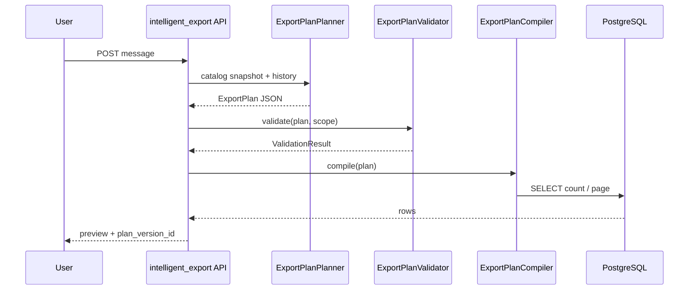

# ADR-004: ExportPlan — JSON Schema, Validator, Query Compiler

**Статус:** Принято  
**Дата:** 2026-06-25  

---

## Решение

### 1. Контракт ExportPlan v1.0

Файл: [`export_plan.schema.json`](export_plan.schema.json)  
Pydantic: [`app/services/export_plan/models.py`](../../app/services/export_plan/models.py)

AI (ExportPlanPlanner) **только** возвращает JSON, соответствующий schema. Парсинг через Pydantic → `ExportPlan`.

### 2. Metadata Catalog

[`FieldCatalog.load()`](../../app/services/export_plan/catalog.py) строит whitelist из:
- `DENORM_FIELD_MAP` — системные колонки `crm_entities`
- `crm_field_definitions` + `crm_field_semantics` — UF и прочие поля (`storage=jsonb`)

Validator отклоняет любой `field_code` вне catalog.

### 3. ExportPlanValidator

[`ExportPlanValidator`](../../app/services/export_plan/validator.py):
- Проверка catalog, filter ops, transform ops, join aliases
- `ExportScope` — role-based limits (ADR-001)
- Viewer: обязательный filter `ASSIGNED_BY_ID eq crm_user_external_id`
- `max_rows` cap vs `max_export_size`

**Не доверяет AI** — даже valid JSON может быть отклонён.

### 4. ExportPlanCompiler

[`ExportPlanCompiler`](../../app/services/export_plan/compiler.py):
- Input: validated `ExportPlan`
- Output: `CompiledQuery` with SQLAlchemy `Select` objects
- **Запрещено:** `text()`, raw SQL strings, `eval`, dynamic JSONPath from user/AI
- Filters только из whitelist ops → SQLAlchemy expressions
- Fields: column map или `raw_payload` JSON subscript (PG JSONB / SQLite JSON for tests)

### 5. ExportPlanPlanner (AI) — отдельный сервис (следующая фаза)

Паттерн [`BitrixMetadataAIService`](../../app/services/bitrix_import/metadata_ai_service.py):
```python
client.chat.completions.create(
    model=...,
    messages=[system, user],
    response_format={"type": "json_schema", "json_schema": EXPORT_PLAN_SCHEMA},
)
```

System prompt содержит:
- Сжатый snapshot catalog (field codes + display names, **без значений CRM**)
- Project memory entries (terms, aliases)
- Clarification instructions

**Не использовать** [`AIService.chat`](../../app/services/ai_service.py) с Bitrix tools для intelligent export.

### 6. Transformation & Validation engines (следующая фаза)

| Component | Module (planned) | Input |
|-----------|------------------|-------|
| TransformationEngine | `export_plan/transformer.py` | rows + plan.transforms |
| ValidationEngine | `export_plan/row_validator.py` | rows + plan.validation_rules |

MVP compiler + Excel generic builder достаточны для preview v1.

### 7. OpenAI JSON Schema for planner

Дублировать `export_plan.schema.json` в Python constant `EXPORT_PLAN_OPENAI_SCHEMA` (strict mode) — как `FIELD_SCHEMA` в metadata AI.

---

## Pipeline diagram



---

## Тесты

[`tests/test_export_plan.py`](../../tests/test_export_plan.py) — validator, model parsing, compiler structure.

## Альтернативы (отклонены)

| Альтернатива | Причина |
|--------------|---------|
| Extend AIService tools | Live Bitrix; no plan persistence; injection risk |
| SQL generation by LLM | Blocked by security requirements |
| GraphQL over CRM | Over-engineering for current scope |
