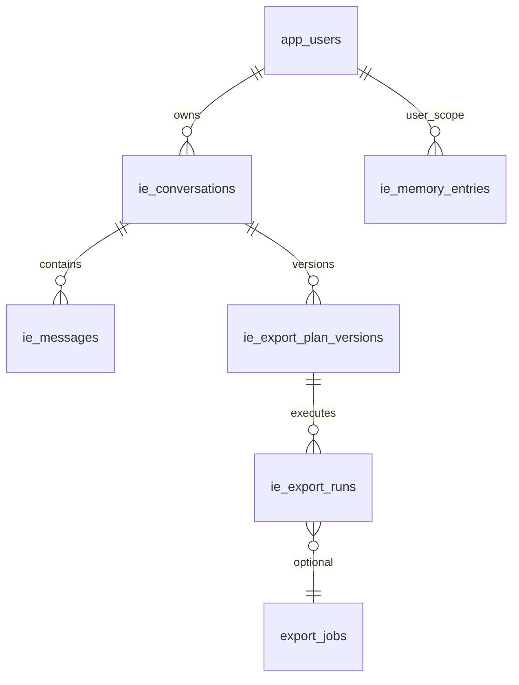

# ADR-005: Персистентность — диалоги, планы, память

**Статус:** Принято  
**Дата:** 2026-06-25  

---

## Новые таблицы

Реализация: [`app/models/intelligent_export.py`](../../app/models/intelligent_export.py)  
Migration: [`alembic/versions/3a1c_export_plan_schema.py`](../../alembic/versions/3a1c_export_plan_schema.py)

### `app_users`

| Column | Type | Notes |
|--------|------|-------|
| `id` | PK | |
| `portal_id` | string(255) | tenant isolation |
| `email` | string(255) unique per portal | login |
| `password_hash` | text | bcrypt |
| `display_name` | string(255) | |
| `role` | string(32) | admin/analyst/viewer |
| `crm_user_external_id` | int nullable | Bitrix user for scope |
| `is_active` | bool | |
| `created_at`, `updated_at` | timestamptz | |

### `ie_conversations`

| Column | Type | Notes |
|--------|------|-------|
| `id` | PK | |
| `portal_id` | string | |
| `user_id` | FK → app_users.id (app-level) | owner |
| `title` | string(255) | auto from first message |
| `status` | string(32) | active/archived |
| `current_plan_version_id` | int nullable | pointer to latest validated plan |
| `created_at`, `updated_at` | timestamptz | |

Index: `(portal_id, user_id, updated_at DESC)`

### `ie_messages`

| Column | Type | Notes |
|--------|------|-------|
| `id` | PK | |
| `conversation_id` | int index | |
| `role` | string(16) | user/assistant/system/tool |
| `content` | text | |
| `metadata_json` | JSONB | tokens, tool calls summary |
| `created_at` | timestamptz | |

Index: `(conversation_id, id)`

### `ie_export_plan_versions`

| Column | Type | Notes |
|--------|------|-------|
| `id` | PK | |
| `conversation_id` | int index | |
| `version_number` | int | 1..N per conversation |
| `plan_json` | JSONB | full ExportPlan |
| `plan_hash` | string(64) | dedup |
| `validation_result_json` | JSONB | issues, valid flag |
| `catalog_snapshot_hash` | string(64) | catalog at validation time |
| `created_by_user_id` | int | |
| `created_at` | timestamptz | |

Unique: `(conversation_id, version_number)`

**Rollback:** set `current_plan_version_id` to prior version — no delete.

### `ie_memory_entries`

Project + user memory in one table with scope discriminator.

| Column | Type | Notes |
|--------|------|-------|
| `id` | PK | |
| `portal_id` | string | |
| `scope` | string(16) | `project` \| `user` |
| `user_id` | int nullable | required if scope=user |
| `kind` | string(32) | term/alias/mapping/template/rule/instruction |
| `key` | string(255) | lookup key |
| `value_json` | JSONB | structured payload |
| `content` | text | human text / AI instruction |
| `version` | int | increment on update |
| `is_active` | bool | soft delete |
| `created_by_user_id` | int | |
| `created_at`, `updated_at` | timestamptz | |

Index: `(portal_id, scope, kind, key)`  
Unique: `(portal_id, scope, user_id, kind, key)` where active

**Примеры value_json:**
```json
{"alias": "регион", "field_ref": {"entity_type_id": 2, "field_code": "UF_CRM_5ECE25C5D78E0"}}
{"external_system": "tomoru", "mapping": {"NEW": "new_lead"}}
```

### `ie_export_runs`

Links intelligent export execution to `export_jobs` (optional FK by job id).

| Column | Type | Notes |
|--------|------|-------|
| `id` | PK | |
| `portal_id` | string | |
| `user_id` | int | |
| `conversation_id` | int nullable | |
| `plan_version_id` | int | |
| `export_job_id` | int nullable | → export_jobs.id |
| `status` | string(32) | preview/queued/running/completed/failed |
| `row_count` | int | |
| `error_row_count` | int | |
| `result_summary_json` | JSONB | validation stats |
| `created_at`, `finished_at` | timestamptz | |

### Расширение `export_jobs`

| New column | Type | Notes |
|------------|------|-------|
| `created_by_user_id` | int nullable | ADR-001 ownership |
| `plan_version_id` | int nullable | link to ie_export_plan_versions |

---

## ER diagram



---

## Memory levels mapping

| Level | Storage |
|-------|---------|
| System metadata | existing `crm_field_*`, dictionaries |
| Project memory | `ie_memory_entries` scope=project |
| User memory | `ie_memory_entries` scope=user |
| Dialog context | `ie_messages` + current plan version |

---

## Retention (defaults, configurable via app_settings)

| Data | Default TTL |
|------|-------------|
| ie_messages | 365 days |
| ie_export_plan_versions | unlimited (per conversation) |
| export files | 90 days |
| ie_export_runs | 180 days |

Cleanup job — future cron/scheduler (not in MVP).

---

## Repository layer (planned)

`app/repositories/intelligent_export_repository.py`:
- Conversation CRUD scoped by user_id
- append_message, save_plan_version, list_memory

No ORM `relationship()` — consistent with existing [`crm_repository.py`](../../app/repositories/crm_repository.py) style.
