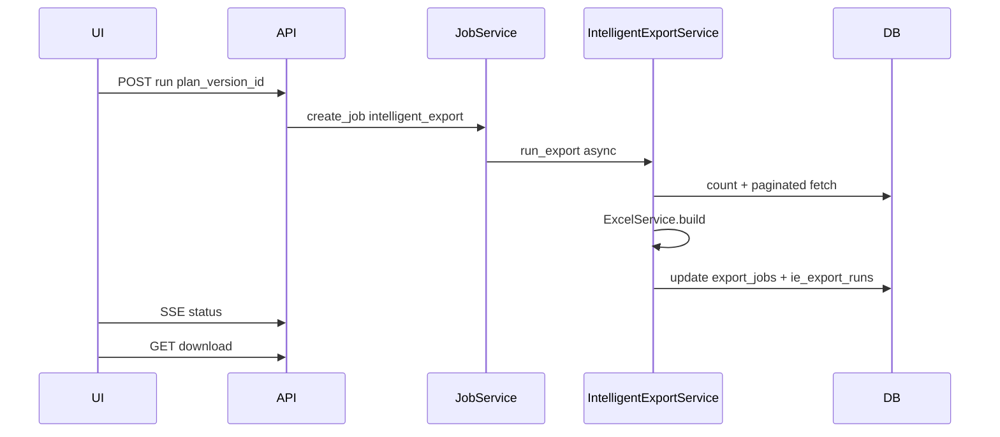

# ADR-006: Job pipeline — preview и long-running export

**Статус:** Принято  
**Дата:** 2026-06-25  
**Контекст:** [`JobService`](../../app/services/job_service.py) — ThreadPoolExecutor, modes region/stage/category_full/region_lpr.

---

## Решение

### 1. Новый mode: `intelligent_export`

Расширить [`JobService._run_job`](../../app/services/job_service.py):

```python
elif job.mode == "intelligent_export":
    result_path = IntelligentExportService(...).run_export(params)
```

**parameters_json** structure:
```json
{
  "plan_version_id": 42,
  "conversation_id": 7,
  "preview": false
}
```

### 2. Preview vs Full run

| Operation | Sync/Async | Limit | Endpoint (planned) |
|-----------|------------|-------|-------------------|
| **Preview** | Sync in request | `min(100, plan limit)` | `POST /api/intelligent-export/preview` |
| **Count** | Sync | — | `POST /api/intelligent-export/count` |
| **Full export** | Async JobService | plan limit capped by scope | `POST /api/intelligent-export/run` |
| **Download** | FileResponse | existing pattern | `GET /exports/{job_id}/download` |

Preview flow:
1. Load plan_version → validate (re-validate if catalog hash changed)
2. Compile → `fetch_page(limit=100)`
3. Transform columns (phase 2)
4. Return JSON `{columns, rows, total_count, validation_issues}`

**Не создаёт** `export_jobs` запись (unless user saves preview as draft).

### 3. IntelligentExportService (planned module)

Path: `app/services/intelligent_export_service.py`

Responsibilities:
- Orchestrate validator + compiler + transformer + excel/csv output
- Reuse [`ExcelService.build_generic`](../../app/services/excel_service.py) for MVP single sheet
- Multi-sheet: map `plan.output.sheets` → multiple generic/wide builders
- Write [`write_export_json`](../../app/services/json_export_service.py) sidecar
- Update `ie_export_runs` + `export_jobs.statistics_json`

Callbacks (same as existing exports):
- `cancel_check`, `progress_callback`, `log_callback`

### 4. Progress & SSE

Reuse existing:
- `GET /api/exports/{job_id}/status` with `Accept: text/event-stream`
- Progress steps: validate → count → fetch batch → transform → write excel

`progress_total` = row count from compiler.count()

### 5. Worker placement

| Workload | Process | Rationale |
|----------|---------|-----------|
| Preview (≤100 rows) | **web** | low latency |
| Export ≤ `max_export_size` | **web** ThreadPoolExecutor | reuse JobService |
| Export > 5000 rows (future) | **dedicated worker** or second pool | avoid blocking HTTP |

**MVP:** all in web ThreadPoolExecutor (same as current exports).

**Phase 2:** optional `export_worker` service mirroring [`app/worker.py`](../../app/worker.py) polling `export_jobs` — only if row limits increase.

### 6. Cancel & retry

- Cancel: existing `cancel_requested` flag — compiler checks between batches
- Retry: `JobService.retry_job` with same `plan_version_id`
- Re-run historical plan: new job from `ie_export_plan_versions.id` without re-invoking AI

### 7. Integration with conversations

On successful run:
- `ie_export_runs.export_job_id` = job.id
- Assistant message appended to `ie_messages` with summary + download link

### 8. File storage

Same as legacy:
- Path: `EXPORT_DIR` via [`get_export_dir`](../../app/config.py)
- Filename: [`safe_filename("intelligent_export", label)`](../../app/services/security_service.py)
- Download guard: [`validate_download_path`](../../app/services/security_service.py) + user owns job

---

## API sketch (planned router)

| Method | Path | Role |
|--------|------|------|
| POST | `/api/intelligent-export/conversations` | analyst+ |
| GET | `/api/intelligent-export/conversations` | analyst+ |
| GET | `/api/intelligent-export/conversations/{id}/messages` | owner |
| POST | `/api/intelligent-export/conversations/{id}/chat` | analyst+ → planner |
| GET | `/api/intelligent-export/plans/{version_id}` | owner |
| POST | `/api/intelligent-export/preview` | analyst+ |
| POST | `/api/intelligent-export/run` | analyst+ |
| GET | `/api/intelligent-export/memory` | analyst+ read, admin write |

Register in [`app/main.py`](../../app/main.py): `app.include_router(intelligent_export.router)`.

---

## Sequence: full export



---

## Risks

| Risk | Mitigation |
|------|------------|
| Thread pool starvation | `MAX_WORKERS` config; separate pool for intelligent (phase 2) |
| Long JSONB queries | ADR-003 field_values; GIN index |
| Stale plan vs catalog | Re-validate on run; store catalog_snapshot_hash |
| No auth on download | ADR-001 job ownership |
